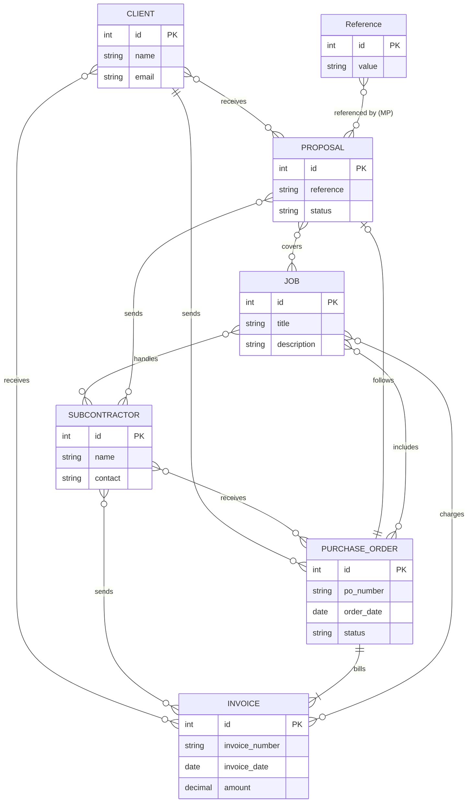

# ERD — Backend data model (initial draft)

**Source:** provided by Mohamed, 2026-07-16. Backend is out of scope for now (frontend is mock-driven); this is the reference the mocks and types should stay compatible with.

## Mapping to the frontend model (`two_sided_documents_spec.md`)

| ERD | Frontend (v1 mocks/types) | Notes |
|---|---|---|
| `CLIENT` / `SUBCONTRACTOR` | `ClientContact` (`mocks/clients*`) / `Contractor` (`mocks/contractors.ts`) | Separate entities, same shape for now. Client *sends* POs and *receives* proposals/invoices; subcontractor mirrors — this is exactly the `direction` model (spec §0.1). |
| `PROPOSAL` / `PURCHASE_ORDER` / `INVOICE` | `Proposal` / `PurchaseOrder` / `Invoice` types | Frontend adds the fields the ERD elides (line items, tax, totals, dates, notes, direction, engagement links). |
| `PURCHASE_ORDER follows PROPOSAL` (1 → 0..1) | `PurchaseOrder.proposal_id?` | Optional link, matches spec §4.2 field 4. |
| `PURCHASE_ORDER bills INVOICE` (1 → many) | `Invoice.po_id?` | Spec allows invoices without a PO (proposal-only or standalone); flag for backend discussion — ERD's `\|{` implies every invoice has a PO. |
| `JOB` (many-to-many everywhere) | `JobCode` string union + `job_code` per line item | v1 treats jobs as a fixed tag list; open question §15.4 of the spec. |
| `Reference` (MP only) | `mocks/references.ts` dropdown | Meeting note 2026-05-12: "MP proposal: Reference field as dropdown". |

Not yet in the ERD (needed eventually, per spec): engagement cross-links (received invoice → client PO / owner invoice — mandatory), payment terms list, MP destinations, tax rates, users/audit log.
